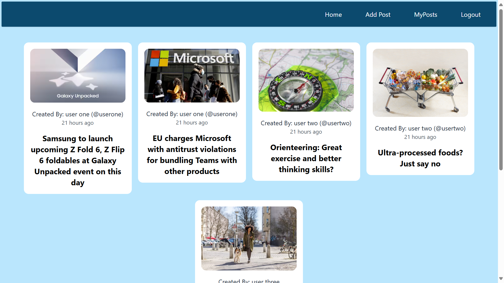

# Post-Comment Service
A user-friendly and responsive posts sharing web application, where user can create posts using inbuilt Rich text editor. In this application user can create, update, delete posts. User can also comment on the posts along with edit and delete comment feature.

## Table of Contents
- [Post-Comment Service](#post-comment-service)
  - [Table of Contents](#table-of-contents)
  - [Set up ans Run](#set-up-ans-run)
  - [Features](#features)
  - [Technologies](#technologies)
      - [Frontend-backend](#frontend-backend)
      - [Key technology features](#key-technology-features)
  - [Why I prefered given tech stack and database ?](#why-i-prefered-given-tech-stack-and-database-)
    - [Frontend](#frontend)
    - [Backend](#backend)
    - [Database](#database)
    - [Cloud Storage](#cloud-storage)

## Set up ans Run

1. **Download and Extract**:
   - Download the zip folder of this project from the 'code' section of the repository.
   - Extract the folder to your desired location.

2. **Open in an Editor (e.g., Visual Studio Code)**:
   - Open your preferred code editor (e.g., VS Code).
   - Navigate to the extracted project folder and open it in your editor.

3. **Folder Structure**:
   - Inside the main folder, you'll find two subfolders:
     - `backend`: Contains the backend code.
     - `frontend`: Contains the frontend code.

4. **Setting Up Terminals**:
   - Open two separate terminals.

5. **Backend Setup (Terminal 1)**:
   - In Terminal 1, navigate to the `backend` folder:
     ```
     cd backend
     ```
   - Install the required dependencies:
     ```
     npm install
     ```
   - Start the backend server in development mode:
     ```
     npm run dev
     ```

6. **Frontend Setup (Terminal 2)**:
   - In Terminal 2, navigate to the `frontend` folder:
     ```
     cd frontend
     ```
   - Install the required dependencies:
     ```
     npm install
     ```
   - Start the frontend development server:
     ```
     npm run dev
     ```

7. **Usage**
    - Open url http://localhost:5173/ to test the application.

<span style="color:green;">If you find any difficulty or problem while set, please contact me at 'akshat1226@gmail.com'</span>

<span style="color:red;">Important Note:</span> While I’ve included the .env files in this repository for your convenience during installation, I am aware that pushing sensitive information (such as API keys or credentials) to a public GitHub repository is generally not recommended. But I have done this only for your convenience.


## Features
Here is the overview of the features of the project.

Login page: User can login using registered email and password.


---

If the user is not registered then, he/she can register using signup page.


---

After successful login User will be redirected to the home page where one can see all the posts created by other users and marked as active.



---

On clicking the "Add post" button on Home page, user can create a post by filling the details like title, content, featured image and status.


---

The "Edit" and "Delete" buttons appears only to the owner of the post. The post page is given below, which have post, comments and add comment feature.


## Technologies

#### Frontend-backend

| Frontend              |   Backend     |  Database  |  Cloud Storage  |
|-----------------------|---------------|------------|-----------------|
|  HTML                 |   JavaScript  |  MongoDB   |   Cloudinary    |
|  CSS                  |   Express.js  |
|  JavaScript           |   Mongoose    |
|  React.js             |   json web token
|  Tailwind CSS         |

#### Key technology features
* Integrated JWT authentication for secure user access and privacy.
* Used Cloudinary for efficient and secure post thumbnail uploads,
ensuring seamless streaming and storage.
* Leveraged MongoDB aggregation pipelines for optimized data
retrieval and manipulation, enhancing overall platform performance.
* Implimented Tiny MCE Rich text editor for to generate posts and comments with rich text.

## Why I prefered given tech stack and database ?

### Frontend
JavaScript: Essential for adding interactivity and dynamic content to web pages. Its versatility makes it a core part of both client-side and server-side development.

React.js: A powerful JavaScript library for building user interfaces, especially single-page applications. React's component-based architecture allows for reusable components and efficient updates, enhancing development speed and user experience.

### Backend
JavaScript (Node.js): Using JavaScript on the backend with Node.js allows for a unified language across the entire application, simplifying development and maintenance.

Express.js: A minimal and flexible Node.js web application framework that provides a robust set of features for web and mobile applications. Its simplicity and performance make it a great choice for building APIs and web servers.

Mongoose: An elegant MongoDB object modeling tool designed to work in an asynchronous environment. It simplifies data validation, casting, and business logic, making it easier to work with MongoDB.

### Database
MongoDB: A NoSQL database that offers high performance, high availability, and easy scalability. Its flexible schema design aligns well with agile development practices, allowing for rapid iteration and adaptation to changing requirements.

### Cloud Storage
Cloudinary: A comprehensive cloud-based image and video management solution. It offers powerful APIs for uploading, transforming, and delivering media assets efficiently, making it ideal for modern web applications that require dynamic media content.

---